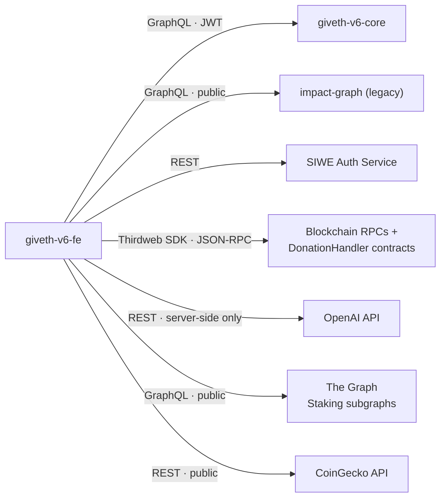
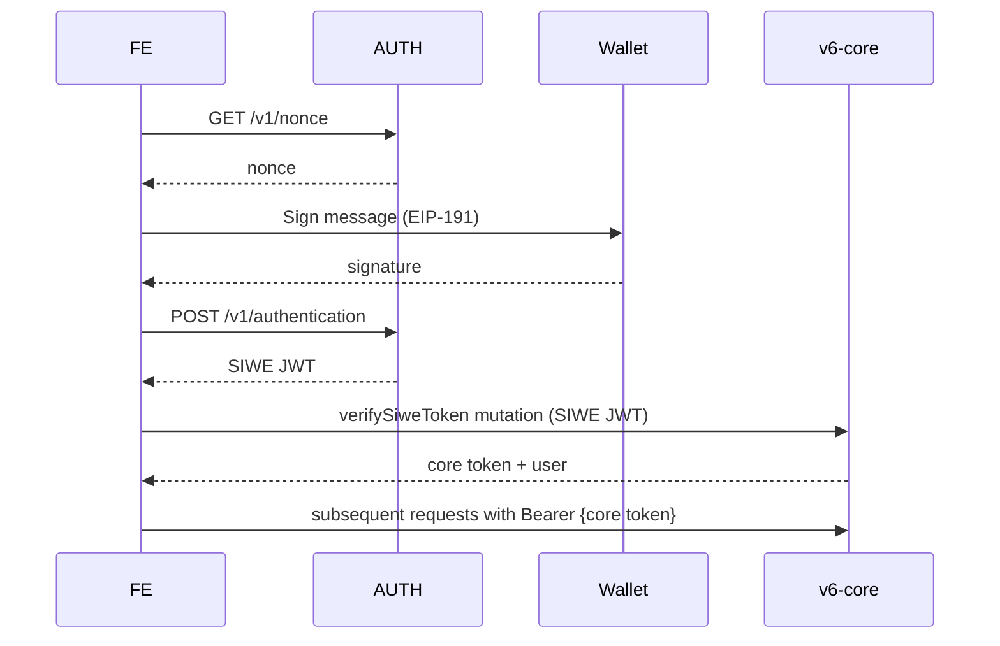

# System Architecture — Frontend Perspective

> Only the external services this frontend talks to, how to talk to them, and the auth model. For frontend-internal structure, coding style, and commands see [AGENTS.md](../AGENTS.md).

## Service Map

---

## 1. giveth-v6-core — Primary Backend

|            |                                                                                                    |
| ---------- | -------------------------------------------------------------------------------------------------- |
| Protocol   | GraphQL via `graphql-request`                                                                      |
| Env var    | `NEXT_PUBLIC_GRAPHQL_ENDPOINT`                                                                     |
| Production | `https://core.v6.giveth.io/graphql`                                                                |
| Staging    | `https://core.v6-staging.giveth.io/graphql`                                                        |
| Local      | `http://localhost:4000/graphql`                                                                    |
| Auth       | `Authorization: Bearer {token}` (core token from `verifySiweToken` mutation — see SIWE flow below) |

Used for: projects, donations, users, QF rounds, categories, matching, staking, passport eligibility, project image uploads.

---

## 2. impact-graph — Legacy Backend

|            |                                                |
| ---------- | ---------------------------------------------- |
| Protocol   | GraphQL via `graphql-request`                  |
| Env var    | `NEXT_PUBLIC_IMPACT_GRAPH_URL`                 |
| Production | `https://mainnet.serve.giveth.io/graphql`      |
| Staging    | `https://impact-graph.serve.giveth.io/graphql` |
| Auth       | None (public)                                  |

Used for: user-exists check by wallet, creating user records (sync during auth), QF Apply flow (project data by slug).

Code: `src/lib/impact-graph/client.ts`, `src/lib/impact-graph/userSync.ts`, `src/app/qf/apply/QfApplyGatePageClient.tsx`.

> These calls should migrate to v6-core and be removed from the frontend when ready.

---

## 3. SIWE Auth Service

|          |                                     |
| -------- | ----------------------------------- |
| Protocol | REST                                |
| Env var  | `NEXT_PUBLIC_SIWE_AUTH_SERVICE_URL` |
| Default  | `https://auth.giveth.io`            |

| Method | Path                 | Purpose                        |
| ------ | -------------------- | ------------------------------ |
| GET    | `/v1/nonce`          | Get nonce to sign              |
| POST   | `/v1/authentication` | Submit signature → receive JWT |
| POST   | `/v1/logout`         | Invalidate JWT                 |

Code: `src/lib/auth/siwe.service.ts`

---

## 4. OpenAI API — AI Project Creation

Server-side only (`src/app/api/ai/create-project/route.ts`). Streams conversational text via SSE (`assistant_delta` events), then may make a second `/v1/responses` call with structured outputs to extract form field patches.

|               |                                       |
| ------------- | ------------------------------------- |
| Endpoint      | `POST {OPENAI_BASE_URL}/v1/responses` |
| Default base  | `https://api.openai.com`              |
| Default model | `gpt-5-mini`                          |
| Auth          | `Bearer {OPENAI_API_KEY}`             |

Server-only env vars: `OPENAI_API_KEY` (required), `OPENAI_MODEL`, `OPENAI_BASE_URL` (optional).

---

## 5. Thirdweb SDK — Wallets & Contracts

Client-side. Config at `src/lib/thirdweb/client.ts`, providers at `src/app/providers.tsx`.

|          |                                             |
| -------- | ------------------------------------------- |
| Env var  | `NEXT_PUBLIC_THIRDWEB_CLIENT_ID` (required) |
| Optional | `NEXT_PUBLIC_WALLETCONNECT_PROJECT_ID`      |

Handles wallet connection, ENS resolution, on-chain reads/writes (DonationHandler contract, ERC-20 approvals), EIP-5792 batch transactions, and Safe multisig detection.

Supported chains and wallets are configured in code — see the files above rather than duplicating here.

For donation contract integration details (addresses, EIP-5792/7702 flows, token lists, fallback logic), see [donation-handler-integration.md](./donation-handler-integration.md).

---

## 6. The Graph — Staking Subgraphs

|          |                                                                                      |
| -------- | ------------------------------------------------------------------------------------ |
| Protocol | GraphQL via `fetch` (POST to subgraph URL)                                           |
| URLs     | Hard-coded per chain in `src/lib/constants/staking-power-constants.tsx`              |
| Auth     | Optional `Bearer {NEXT_PUBLIC_SUBGRAPH_API_KEY}` header (omitted if env var not set) |

Used for: GIVpower staking data, token distribution balances, and reward stream info. Each chain (Optimism, Gnosis, Ethereum, Polygon zkEVM) has its own subgraph URL pointing to `gateway.thegraph.com` or `gateway-arbitrum.network.thegraph.com`.

Code: `src/lib/helpers/stakeHelper.ts` (`querySubgraph` function).

---

## 7. CoinGecko API — Token Pricing

|          |                                                 |
| -------- | ----------------------------------------------- |
| Protocol | REST via `fetch`                                |
| Endpoint | `https://api.coingecko.com/api/v3/simple/price` |
| Auth     | None (public, rate-limited)                     |

Used for: fetching USD prices of tokens by their CoinGecko ID (e.g. for displaying donation values in the cart).

Code: `src/lib/helpers/cartHelper.ts` (`getTokenPriceInUSDByCoingeckoId`).
