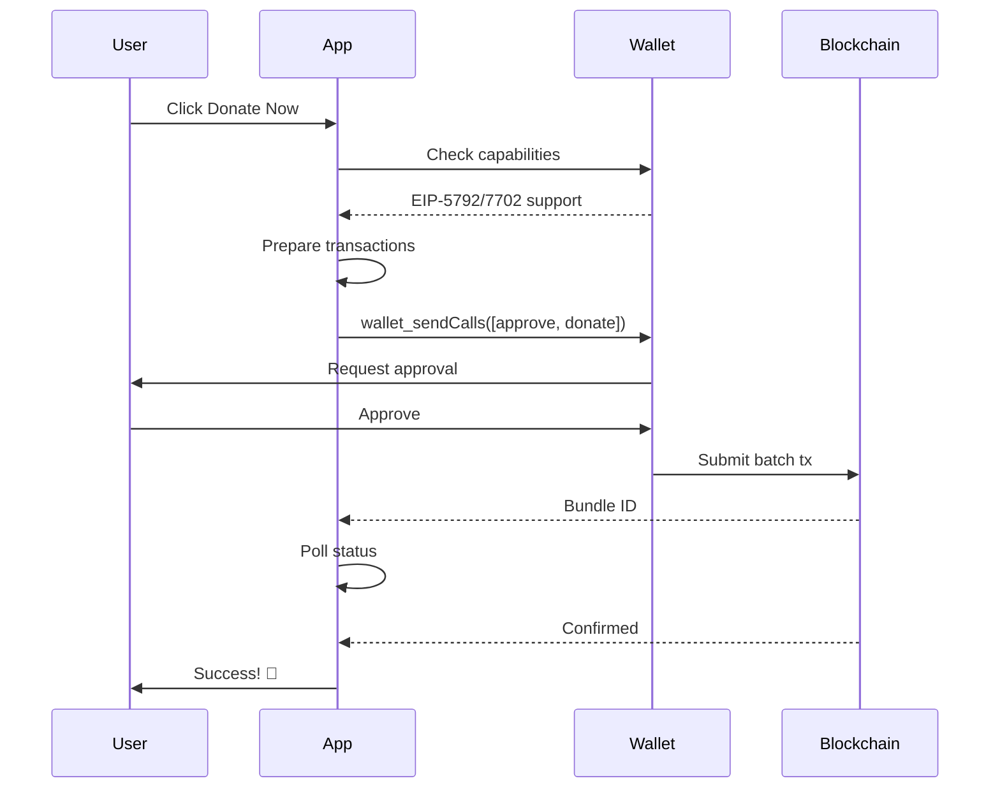

# Donation Handler Integration with EIP-7702 and EIP-5792

This document describes the integration of the donation handler contract with support for EIP-7702 and EIP-5792, enabling single-transaction token approvals and donations.

## Overview

The donation handler integration allows users to:

1. **Make donations to projects** using ERC-20 tokens
2. **Batch multiple donations** into a single transaction
3. **Approve and donate in one transaction** using EIP-5792
4. **Benefit from enhanced wallet features** with EIP-7702

## Contract Details

- **Contract Address**: `0x6e349c56f512cb4250276bf36335c8dd618944a1`
- **Network**: Polygon (Chain ID: 137)
- **Type**: Donation Handler (Proxy Contract)

## EIP Support

### EIP-5792: Batch Transactions

EIP-5792 introduces the `wallet_sendCalls` method, which allows dApps to send multiple function calls in a single transaction. This is used to combine:

1. Token approval (`approve`)
2. Donation execution (`donate` or `batchDonate`)

**Benefits**:
- Single user confirmation instead of two
- Reduced gas costs
- Atomic execution (all or nothing)
- Better UX

### EIP-7702: Temporary Account Abstraction

EIP-7702 allows Externally Owned Accounts (EOAs) to temporarily adopt smart contract functionalities during a transaction. This enables:

- Transaction batching without converting to a smart contract wallet
- Gas sponsorship capabilities
- Enhanced delegation features

**Benefits**:
- Keep using your EOA wallet address
- Access advanced features temporarily
- No migration needed

## Architecture

### File Structure

```
src/
├── lib/
│   ├── contracts/
│   │   └── donation-handler.ts       # Contract ABI and helpers
│   └── web3/
│       └── batch-transactions.ts     # EIP-5792 implementation
├── hooks/
│   └── useDonation.ts                # Donation hook
├── context/
│   └── CartContext.tsx               # Cart state management
└── components/
    └── cart/
        ├── donation-sidebar.tsx      # Donation UI
        └── transaction-status.tsx    # Status tracking
```

### Key Components

#### 1. Donation Handler Contract Service

**File**: `src/lib/contracts/donation-handler.ts`

Provides:
- Contract ABI and addresses
- Helper functions for preparing transactions
- Token address mappings
- Type definitions

```typescript
// Get contract instance
const contract = getDonationHandlerContract(chainId);

// Prepare batch donation
const tx = prepareBatchDonation(
  contract,
  recipients,
  amounts,
  tokenAddress
);
```

#### 2. Batch Transactions Utility

**File**: `src/lib/web3/batch-transactions.ts`

Implements EIP-5792:
- `sendBatchCalls()` - Send multiple calls in one transaction
- `getBatchCallsStatus()` - Check transaction status
- `waitForBatchCalls()` - Wait for confirmation
- `checkWalletCapabilities()` - Check EIP support

```typescript
// Send batch transaction
const { bundleId } = await sendBatchCalls({
  account,
  calls: [approvalCall, donationCall],
  chainId
});

// Wait for confirmation
const status = await waitForBatchCalls(provider, bundleId);
```

#### 3. useDonation Hook

**File**: `src/hooks/useDonation.ts`

Main hook for donation functionality:

```typescript
const { state, donate, batchDonate, reset } = useDonation();

// Single donation
await donate({
  projectAddress: '0x...',
  amount: parseUnits('100', 18),
  tokenAddress: '0x...',
  tokenSymbol: 'USDT',
  chainId: 137
});

// Batch donations
await batchDonate({
  donations: [...],
  chainId: 137,
  tokenAddress: '0x...',
  totalAmount: parseUnits('1000', 18)
});
```

**States**:
- `idle` - Initial state
- `preparing` - Preparing transaction
- `awaiting_approval` - Waiting for user approval
- `processing` - Transaction submitted
- `confirming` - Waiting for confirmation
- `success` - Transaction successful
- `error` - Transaction failed

#### 4. Cart Context

**File**: `src/context/CartContext.tsx`

Enhanced cart with donation tracking:

```typescript
const {
  cartItems,
  donationRounds,
  updateProjectDonation,
  getDonationsByChain,
  getTotalDonationForRound
} = useCart();

// Update donation amount
updateProjectDonation(
  projectId,
  amount,
  tokenSymbol,
  tokenAddress,
  chainId
);
```

#### 5. Transaction Status Component

**File**: `src/components/cart/transaction-status.tsx`

Visual feedback for transaction status:

```tsx
<TransactionStatus
  status={state.status}
  transactionHash={state.transactionHash}
  bundleId={state.bundleId}
  error={state.error}
  chainId={137}
  supportsEIP5792={state.supportsEIP5792}
  supportsEIP7702={state.supportsEIP7702}
/>
```

## Usage Flow

### 1. User Journey

1. **Browse projects** and add to cart
2. **Review cart** with donation amounts
3. **Click "Donate Now"** in sidebar
4. **Wallet checks** for EIP-5792/7702 support
5. **Single approval** for both token approval and donation
6. **Transaction confirmation** with live status updates
7. **Success** with transaction receipt

### 2. Technical Flow



### 3. Fallback Mechanism

If wallet doesn't support EIP-5792:

1. **Sequential execution**: Approve → Donate
2. **Two separate transactions**
3. **Two user approvals required**
4. **Higher gas costs**

```typescript
// Automatic fallback in useDonation hook
if (!capabilities.supportsAtomicBatch) {
  // 1. Approve tokens
  await sendTransaction({ transaction: approvalTx, account });
  
  // 2. Execute donation
  await sendTransaction({ transaction: donationTx, account });
}
```

## Configuration

### Supported Chains

Currently configured for:
- **Polygon (137)**: Main deployment
- **Optimism (10)**: Coming soon
- Other chains: Add to `DONATION_HANDLER_ADDRESSES`

### Token Addresses

Pre-configured tokens in `TOKEN_ADDRESSES`:

**Polygon (137)**:
- USDT: `0xc2132D05D31c914a87C6611C10748AEb04B58e8F`
- USDC: `0x2791Bca1f2de4661ED88A30C99A7a9449Aa84174`
- DAI: `0x8f3Cf7ad23Cd3CaDbD9735AFf958023239c6A063`
- WETH: `0x7ceB23fD6bC0adD59E62ac25578270cFf1b9f619`

**Optimism (10)**:
- USDT: `0x94b008aA00579c1307B0EF2c499aD98a8ce58e58`
- USDC: `0x7F5c764cBc14f9669B88837ca1490cCa17c31607`
- DAI: `0xDA10009cBd5D07dd0CeCc66161FC93D7c9000da1`
- WETH: `0x4200000000000000000000000000000000000006`

## Wallet Compatibility

### Fully Compatible Wallets

Wallets supporting EIP-5792 and/or EIP-7702:
- **MetaMask** (with experimental features)
- **Coinbase Wallet** (EIP-5792)
- **WalletConnect** (some wallet providers)
- **Brave Wallet** (experimental)

### Partially Compatible

Wallets with fallback to sequential:
- **Trust Wallet**
- **Rainbow**
- **Argent**
- Most other wallets

### Checking Support

```typescript
import { checkWalletCapabilities } from '@/lib/web3/batch-transactions';

const provider = wallet.getProvider();
const capabilities = await checkWalletCapabilities(provider);

console.log({
  eip5792: capabilities.supportsEIP5792,
  eip7702: capabilities.supportsEIP7702,
  atomicBatch: capabilities.supportsAtomicBatch
});
```

## Testing

### Local Testing

1. **Start development server**:
   ```bash
   pnpm dev
   ```

2. **Connect compatible wallet** (MetaMask with experimental features)

3. **Add projects to cart** with donation amounts

4. **Test donation flow**:
   - Check for EIP support banner
   - Click "Donate Now"
   - Approve in wallet
   - Monitor status updates

### Testing with Different Wallets

1. **Test EIP-5792 support**: Use MetaMask or Coinbase Wallet
2. **Test fallback**: Use Trust Wallet or other wallets
3. **Test error handling**: Cancel transaction, insufficient balance

### Debugging

Enable console logs:

```typescript
// In batch-transactions.ts
console.log('Wallet capabilities:', capabilities);
console.log('Sending batch calls:', calls);
console.log('Bundle ID:', bundleId);
console.log('Status:', status);
```

## Error Handling

### Common Errors

1. **"Wallet does not support EIP-5792"**
   - Fallback to sequential transactions
   - User sees two approval prompts

2. **"Insufficient allowance"**
   - Check token approval
   - Retry approval transaction

3. **"Transaction timeout"**
   - Increase timeout in `waitForBatchCalls`
   - Check blockchain congestion

4. **"User rejected"**
   - Reset state with `reset()`
   - Allow user to retry

### Error Recovery

```typescript
const { state, reset } = useDonation();

// If error occurs
if (state.status === 'error') {
  console.error('Donation failed:', state.error);
  
  // Reset and allow retry
  reset();
}
```

## Security Considerations

1. **Token Approvals**
   - Approve exact amount needed
   - No unlimited approvals
   - Reset allowance after failed tx

2. **Contract Verification**
   - Verify contract on Polygonscan
   - Check proxy implementation
   - Review contract source code

3. **User Protection**
   - Clear status messages
   - Transaction preview
   - Confirmation before execution

4. **Input Validation**
   - Validate addresses
   - Check amounts > 0
   - Verify token decimals

## Future Enhancements

### Planned Features

1. **Multi-chain support**
   - Add more chains
   - Cross-chain donations
   - Bridge integration

2. **Gas optimization**
   - Gas estimation
   - Gas sponsorship (EIP-7702)
   - Meta-transactions

3. **Enhanced UX**
   - Transaction simulation
   - Preview matching funds
   - Donation receipts

4. **Analytics**
   - Track EIP usage
   - Success rates
   - Gas savings

### Contributing

To add new features:

1. Update contract interfaces in `donation-handler.ts`
2. Extend `useDonation` hook for new functionality
3. Add UI components as needed
4. Update this documentation
5. Add tests

## Resources

### EIP Documentation

- [EIP-5792: Wallet Function Call API](https://eips.ethereum.org/EIPS/eip-5792)
- [EIP-7702: Set EOA account code](https://eips.ethereum.org/EIPS/eip-7702)
- [Thirdweb Documentation](https://portal.thirdweb.com/)
- [Viem Documentation](https://viem.sh/)

### Contract

- [Polygonscan](https://polygonscan.com/address/0x6e349c56f512cb4250276bf36335c8dd618944a1)
- [Contract Implementation](https://polygonscan.com/address/0x6e349c56f512cb4250276bf36335c8dd618944a1#code)

## Support

For issues or questions:

1. Check console logs for errors
2. Review transaction on block explorer
3. Verify wallet compatibility
4. Check network status

## License

This integration is part of the Giveth v6 frontend project.

